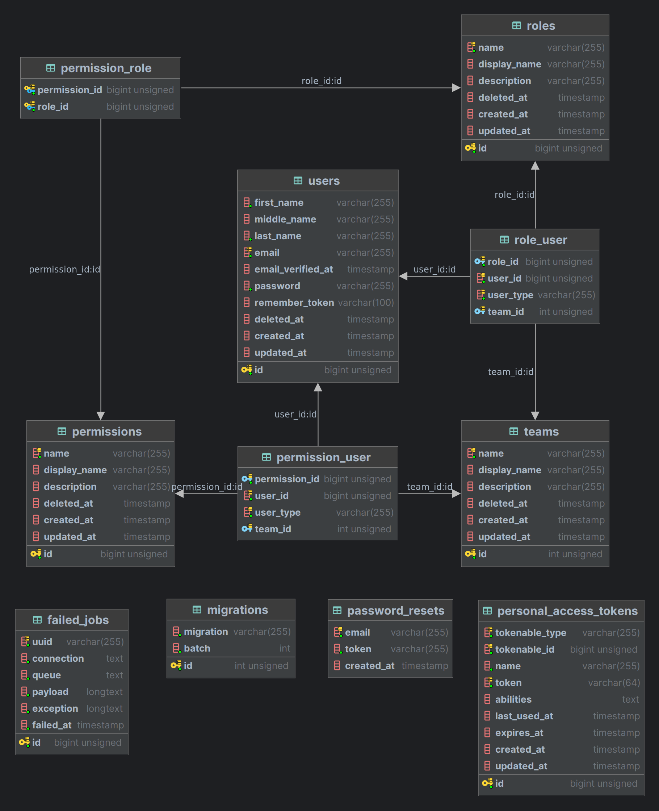

<!-- TOC -->
  * [About the Boilerplate](#about-the-boilerplate)
    * [Dependencies](#dependencies)
    * [Entity Relationship Diagrams](#entity-relationship-diagrams)
  * [About Laravel](#about-laravel)
  * [Learning Laravel](#learning-laravel)
  * [Laravel Sponsors](#laravel-sponsors)
    * [Premium Partners](#premium-partners)
  * [Contributing](#contributing)
  * [Code of Conduct](#code-of-conduct)
  * [Security Vulnerabilities](#security-vulnerabilities)
  * [License](#license)
<!-- TOC -->

## About the Boilerplate

This boilerplate is created to initialize a project faster. This comes with pre-configured packages handpicked by yours truly.

### Dependencies

- Production Dependencies

| Package                 | Version | Purpose                                                                                                        | Documentation                                       |
|-------------------------|---------|:---------------------------------------------------------------------------------------------------------------|-----------------------------------------------------|
| `filament/filament`     | `^2.0`  | Filament is a collection of tools for rapidly building beautiful TALL stack apps, designed for humans.         | https://filamentphp.com/docs/2.x/admin/installation |
| `fligno/api-sdk-kit`    | `^1.4`  | API Integration Starter Kit for Laravel SDK Packages                                                           | https://github.com/Fligno-Software/api-sdk-kit      |
| `fligno/starter-kit`    | `^3.1`  | Starter Kit for Laravel Developers                                                                             | https://github.com/Fligno-Software/starter-kit      |
| `santigarcor/laratrust` | `^7.1`  | Laratrust is a Laravel package that lets you handle very easily roles and permissions inside your application. | https://laratrust.santigarcor.me/docs/7.x/          |

- Development Dependencies

| Package                        | Version | Purpose                                                | Documentation                                            |
|--------------------------------|---------|:-------------------------------------------------------|----------------------------------------------------------|
| `fligno/boilerplate-generator` | `^2.2`  | Boilerplate Generator for Laravel and Laravel Packages | https://github.com/Fligno-Software/boilerplate-generator |

### Entity Relationship Diagram

**Note**: Excluded `laravel/telescope` and `fligno/api-sdk-kit` tables.

## About Laravel

Laravel is a web application framework with expressive, elegant syntax. We believe development must be an enjoyable and creative experience to be truly fulfilling. Laravel takes the pain out of development by easing common tasks used in many web projects, such as:

- [Simple, fast routing engine](https://laravel.com/docs/routing).
- [Powerful dependency injection container](https://laravel.com/docs/container).
- Multiple back-ends for [session](https://laravel.com/docs/session) and [cache](https://laravel.com/docs/cache) storage.
- Expressive, intuitive [database ORM](https://laravel.com/docs/eloquent).
- Database agnostic [schema migrations](https://laravel.com/docs/migrations).
- [Robust background job processing](https://laravel.com/docs/queues).
- [Real-time event broadcasting](https://laravel.com/docs/broadcasting).

Laravel is accessible, powerful, and provides tools required for large, robust applications.

## Learning Laravel

Laravel has the most extensive and thorough [documentation](https://laravel.com/docs) and video tutorial library of all modern web application frameworks, making it a breeze to get started with the framework.

You may also try the [Laravel Bootcamp](https://bootcamp.laravel.com), where you will be guided through building a modern Laravel application from scratch.

If you don't feel like reading, [Laracasts](https://laracasts.com) can help. Laracasts contains over 2000 video tutorials on a range of topics including Laravel, modern PHP, unit testing, and JavaScript. Boost your skills by digging into our comprehensive video library.

## Laravel Sponsors

We would like to extend our thanks to the following sponsors for funding Laravel development. If you are interested in becoming a sponsor, please visit the Laravel [Patreon page](https://patreon.com/taylorotwell).

### Premium Partners

- **[Vehikl](https://vehikl.com/)**
- **[Tighten Co.](https://tighten.co)**
- **[Kirschbaum Development Group](https://kirschbaumdevelopment.com)**
- **[64 Robots](https://64robots.com)**
- **[Cubet Techno Labs](https://cubettech.com)**
- **[Cyber-Duck](https://cyber-duck.co.uk)**
- **[Many](https://www.many.co.uk)**
- **[Webdock, Fast VPS Hosting](https://www.webdock.io/en)**
- **[DevSquad](https://devsquad.com)**
- **[Curotec](https://www.curotec.com/services/technologies/laravel/)**
- **[OP.GG](https://op.gg)**
- **[WebReinvent](https://webreinvent.com/?utm_source=laravel&utm_medium=github&utm_campaign=patreon-sponsors)**
- **[Lendio](https://lendio.com)**

## Contributing

Thank you for considering contributing to the Laravel framework! The contribution guide can be found in the [Laravel documentation](https://laravel.com/docs/contributions).

## Code of Conduct

In order to ensure that the Laravel community is welcoming to all, please review and abide by the [Code of Conduct](https://laravel.com/docs/contributions#code-of-conduct).

## Security Vulnerabilities

If you discover a security vulnerability within Laravel, please send an e-mail to Taylor Otwell via [taylor@laravel.com](mailto:taylor@laravel.com). All security vulnerabilities will be promptly addressed.

## License

The Laravel framework is open-sourced software licensed under the [MIT license](https://opensource.org/licenses/MIT).
